# SharePoint to Azure Blob Storage Sync with AI Search

Sync files from SharePoint Online to Azure Blob Storage with permissions (ACLs), index them in Azure AI Search, and query with document-level security.

## Architecture



Editable source: [docs/diagrams/solution-flows.mmd](docs/diagrams/solution-flows.mmd)

Ingestion flow (SharePoint to AI Search):
1. The sync runtime reads file and permission deltas from SharePoint.
2. Purview sensitivity labels and RMS rights are evaluated.
3. Effective ACLs are computed and persisted with document metadata.
4. Content lands in Blob and is indexed into AI Search with chunks, vectors, and ACL fields.

Query flow (Foundry agent with document security):
1. The user query is sent through a Foundry agent or app layer with Entra ID identity.
2. AI Search executes retrieval with document-level ACL filtering.
3. Only authorized chunks are returned to grounding.
4. The final answer is generated with citations limited to authorized sources.

Network flow:
- Inbound to AI Search is restricted to Private Endpoint paths.
- Outbound from the sync runtime to SharePoint Online is forced through UDR and Azure Firewall.

## Components

| Directory | Description | README |
|-----------|-------------|--------|
| [src/sync/](src/sync/) | SharePoint → Blob sync job — Python (delta API, permissions) | [src/sync/README.md](src/sync/README.md) |
| [src/sync-dotnet/](src/sync-dotnet/) | SharePoint → Blob sync job — C# .NET (same features) | [src/sync-dotnet/README.md](src/sync-dotnet/README.md) |
| [src/demo/](src/demo/) | Flask web app — Entra ID login + ACL-filtered search | [src/demo/README.md](src/demo/README.md) |
| [src/func-verify-scope/](src/func-verify-scope/) | Azure Function — verify SharePoint Sites.Selected scope | [src/func-verify-scope/README.md](src/func-verify-scope/README.md) |
| [infra/ai-search/](infra/ai-search/) | Search index, skillset, indexer deployment | [infra/ai-search/README.md](infra/ai-search/README.md) |
| [infra/deploy-private/](infra/deploy-private/) | Private VNet deployment — Foundry Agent v2 + all resources behind PEs | [infra/deploy-private/README.md](infra/deploy-private/README.md) |
| [tests/](tests/) | Search verification scripts | [tests/README.md](tests/README.md) |
| [docs/](docs/) | Architecture & deep-dives (Purview/RMS, Agentic Retrieval) | See below |

### Documentation

| Document | Description |
|----------|-------------|
| [Purview / RMS Explained](docs/purview-rms-explained.md) | How RMS encryption works, dual-layer ACLs, `Sites.Selected` implications |
| [Agentic Retrieval & Foundry IQ](docs/agentic-retrieval-foundry-iq.md) | Cross-site enterprise search with Agentic Retrieval, Foundry IQ integration, real-world scenarios |

## Quick Start

### Prerequisites

- Python 3.11+
- Azure CLI (`az login`)
- Azure resources: SharePoint site, Storage Account, AI Search, Azure OpenAI

### Run Everything

```bash
# Linux/macOS
./run-all.sh

# Windows (PowerShell)
.\run-all.ps1
```

This syncs files, deploys search components, waits for indexing, and runs tests.

### Run Individual Components

```bash
# Python sync
cd src/sync && python main.py

# .NET sync (build first, then run DLL directly)
cd src/sync-dotnet && dotnet build
dotnet src/SharePointSync.Job/bin/Debug/net10.0/SharePointSync.Job.dll

# Deploy search
cd infra/ai-search && ./script.ps1 ...

# Demo app
cd src/demo && python app.py

# Tests
cd tests && python test_search.py
```

## Configuration

Create a `.env` file in the root (see each component's README for full details):

### Core Settings

| Variable | Required | Description | Example |
|----------|----------|-------------|---------|
| `SHAREPOINT_SITE_URL` | Yes | The SharePoint site URL | `https://contoso.sharepoint.com/sites/MySite` |
| `SHAREPOINT_DRIVE_NAME` | No | Document library name (default: `Documents`) | `Documents`, `Shared Documents` |
| `SHAREPOINT_FOLDER_PATH` | No | Folder path to sync (default: `/` for root) | `/FAQ`, `/Docs/Policies` |
| `AZURE_STORAGE_ACCOUNT_NAME` | Yes | Azure Storage account name | `mystorageaccount` |
| `AZURE_BLOB_CONTAINER_NAME` | No | Container name (default: `sharepoint-sync`) | `sharepoint-docs` |
| `AZURE_BLOB_PREFIX` | No | Prefix for all blobs | `docs/` |
| `DELETE_ORPHANED_BLOBS` | No | Delete blobs removed from SharePoint (default: `false`) | `true` |
| `DRY_RUN` | No | Preview mode without changes (default: `false`) | `true` |
| `SYNC_PERMISSIONS` | No | Enable permissions synchronization (default: `false`) | `true` |
| `SEARCH_SERVICE_NAME` | Yes | AI Search service name | `my-search-service` |
| `SEARCH_API_KEY` | Yes | AI Search admin key | |

### Delta Sync Settings

| Variable | Required | Description | Example |
|----------|----------|-------------|---------|
| `PERMISSIONS_DELTA_MODE` | No | Mode for file and permission change detection (default: `hash`) | `hash`, `graph_delta` |
| `DELTA_TOKEN_STORAGE_PATH` | No | Path to store delta tokens for `graph_delta` mode (default: `.delta_tokens`) | `/data/tokens` |

#### Delta Modes

The `PERMISSIONS_DELTA_MODE` setting controls how both **file changes** and **permission changes** are detected:

**`hash` (Default)**: 
- **File Sync**: Full scan of SharePoint - lists all files and compares with blob metadata (last_modified, content_hash)
- **Permissions**: Computes SHA256 hash of permissions, only syncs if hash differs
- Works independently, no external state needed
- Best for: Most scenarios, simpler setup, smaller document libraries

**`graph_delta`**: 
- **File Sync**: Uses Microsoft Graph delta API to track changes since last sync
  - First run: Enumerates all files (initial baseline)
  - Subsequent runs: Only processes files that have been added, modified, or deleted
  - Handles deletions automatically via delta response
- **Permissions**: Uses Graph delta API with `Prefer: deltashowsharingchanges` header
  - Only syncs files with `@microsoft.graph.sharedChanged` annotation
- Stores delta tokens locally to track sync state between runs
- More efficient for large document libraries (only queries changed items)
- Requires `Sites.FullControl.All` permission for proper operation
- Best for: Large document libraries with frequent changes

> **Note**: The blob metadata format remains the same regardless of delta mode, ensuring no breaking changes when switching modes.

### Purview Integration Settings

Microsoft Purview sensitivity label detection and RMS (Azure Rights Management) protection sync is controlled by a single parameter:

| Variable | Required | Description | Example |
|----------|----------|-------------|---------|
| `SYNC_PURVIEW_PROTECTION` | No | Enable Purview sensitivity label & RMS protection sync (default: `false`) | `true` |

When `SYNC_PURVIEW_PROTECTION=true`, the sync pipeline:

1. **Reads sensitivity labels** from each SharePoint file via Microsoft Graph
2. **Detects RMS encryption** and extracts usage rights (VIEW, EDIT, EXPORT, etc.)
3. **Computes dual-layer ACLs** — effective access = SharePoint permissions ∩ RMS permissions
4. **Writes Purview metadata** to blob storage:

| Blob Metadata Key | Value |
|--------------------|-------|
| `purview_protection_status` | `unprotected`, `protected`, `label_only`, `unknown` |
| `purview_label_id` | GUID of the applied sensitivity label |
| `purview_label_name` | Display name (e.g., `Highly Confidential`) |
| `purview_is_encrypted` | `true` / `false` |
| `purview_rms_permissions` | JSON array of RMS permission entries |
| `purview_detected_at` | ISO timestamp |

#### Required App Permissions

Your Azure AD app registration needs these additional Graph API permissions for Purview:

- `Files.Read.All` — Read files and sensitivity labels on items
- `InformationProtectionPolicy.Read.All` — Read label definitions and RMS policies

> **Note**: If using `Sites.Selected` scope, add the service principal as an **RMS Super User** to decrypt RMS-protected files. See [docs/purview-rms-explained.md](docs/purview-rms-explained.md) for setup details.

## Authentication

| Method | Use Case | Configuration |
|--------|----------|---------------|
| App Registration | Local dev | `AZURE_CLIENT_ID`, `AZURE_CLIENT_SECRET`, `AZURE_TENANT_ID` |
| Federated Identity (secretless) | Function App or job authenticates to Graph via Entra workload identity federation to an App Registration | `AZURE_CLIENT_ID`, `AZURE_TENANT_ID` (no client secret) |
| Managed Identity | Production (Container Apps) | No config needed |
| Azure CLI | Quick local testing | `az login` |

## Production Deployment

Both `sync/` (Python) and `sync-dotnet/` (C#) include deploy scripts for Azure Function App and Azure Container Apps Job. Pick one implementation.

**Docker (Python):**
```bash
cd sync && docker build -t sharepoint-sync:latest .
docker run --env-file .env sharepoint-sync:latest
```

**Docker (.NET):**
```bash
cd sync-dotnet && docker build -t sharepoint-sync-dotnet:latest .
docker run --env-file ../.env sharepoint-sync-dotnet:latest
```

**Azure Function App or ACA Job:** See [sync/deploy/README.md](sync/deploy/README.md) or [sync-dotnet/deploy/README.md](sync-dotnet/deploy/README.md)
## Next Step: Cross-Site Agentic Search with Foundry IQ

This pipeline syncs and secures individual SharePoint sites. The natural evolution is **cross-site AI search** using [Azure AI Search Agentic Retrieval](https://learn.microsoft.com/azure/search/agentic-retrieval-overview) and [Foundry IQ](https://learn.microsoft.com/azure/ai-foundry/agents/concepts/what-is-foundry-iq):

- **Run this pipeline for N sites** → each becomes an indexed knowledge source
- **Add remote SharePoint sources** → for real-time content from supplementary sites (no index needed)
- **Create a Foundry IQ knowledge base** → combines all sources with LLM-powered query planning
- **Connect to Foundry Agent Service** → agents decompose complex questions into parallel subqueries across all sites, with full permission enforcement

Example: *"Compare the data retention policy from Legal with the GDPR checklist on Compliance and tell me if we have any gaps"* → the agent targets each site's knowledge source, merges results, and synthesizes a gap analysis — all respecting per-document ACLs and Purview sensitivity labels.

See **[docs/agentic-retrieval-foundry-iq.md](docs/agentic-retrieval-foundry-iq.md)** for detailed architecture, 5 real-world enterprise scenarios, and getting-started code.

### Private Network Deployment (Foundry Agent v2)

Deploy all resources behind a VNet with private endpoints, plus a Foundry Agent (v2) connected to the AI Search knowledge base:

```bash
cd deploy-private

# Step 1: Foundry instance + VNet + all private resources
./deploy-foundry.sh

# Step 2: Project + capability host + agent (v2 .NET SDK)
PROJECT_NAME=my-project ./deploy-project.sh

# Optional: sync Function App with VNet integration
RUNTIME=python ./deploy-sync-private.sh
```

See [deploy-private/README.md](deploy-private/README.md) for full details, Terraform option, and multi-project setup.

## License

MIT
