# Private Network Deployment

Deploy all resources behind a private VNet with private endpoints, plus a Foundry Agent (v2) connected to a knowledge base.
This is an **alternative** to the public deployment in `sync/deploy/` — existing scripts remain unchanged.
The sync runtime uses **managed identity / federated identity** for secretless authentication.

## Architecture



Editable source: [docs/diagrams/private-network-flows.mmd](../docs/diagrams/private-network-flows.mmd)

- Inbound to AI Search is private only through the AI Search Private Endpoint.
- Outbound from the sync subnet to SharePoint Online is forced through UDR and Azure Firewall for controlled egress.
- SharePoint connection uses Entra workload identity federation between the Function runtime and an App Registration (no client secret).
- Foundry Agent Service uses Standard setup with private networking (BYO VNet) and injects runtime networking into the delegated agent subnet.
- Public network access is disabled for Foundry, AI Search, Storage, and Cosmos DB.
- Private DNS coverage should include `privatelink.cognitiveservices.azure.com`, `privatelink.openai.azure.com`, `privatelink.services.ai.azure.com`, `privatelink.search.windows.net`, `privatelink.blob.core.windows.net`, and `privatelink.documents.azure.com`.

## Network Options Summary

| Option | Network ownership | Inbound access to Foundry/Search/Storage/Cosmos | Outbound control | Required inputs | Use when |
|---|---|---|---|---|---|
| `managed-private` (script) | Script creates VNet + subnets in your RG | Private Endpoints only (public access disabled) | Platform-managed networking for agent injection (`useMicrosoftManagedNetwork=true`) | `SUBSCRIPTION_ID` (+ optional names/prefixes) | Fastest secure start with minimal networking setup |
| `byovnet` (script) | You provide existing VNet/subnets | Private Endpoints only (public access disabled) | Your network path for agent injection (`useMicrosoftManagedNetwork=false`) | `VNET_ID`, `SUBNET_PE_ID`, `SUBNET_AGENT_ID` | Enterprise networking control with existing hub/spoke policies |
| Terraform module (`deploy-private/terraform`) | Choose created VNet or existing VNet/subnets | Private Endpoints only (public access disabled) | Customer-managed topology aligned to BYO pattern (`useMicrosoftManagedNetwork=false`) | `use_existing_vnet` + required IDs in existing mode | IaC-driven private deployment with or without existing network reuse |

Notes:
- In script `managed-private`, resources are still private; the script just creates the VNet/subnets for you.
- In script `byovnet`, your provided subnet for agents must be delegated to `Microsoft.App/environments`.
- Terraform now supports existing VNet deployment via `use_existing_vnet=true` + `existing_vnet_id`, `existing_subnet_pe_id`, `existing_subnet_agent_id`.

## Scripts

| Script | Purpose |
|---|---|
| `deploy-foundry.sh` | **Step 1**: Deploy Foundry account + VNet + Storage + Search + CosmosDB (all private) |
| `deploy-project.sh` | **Step 2**: Create project + capability host + agent (v2 .NET SDK) |
| `deploy-sync-private.sh` | **Optional**: Deploy sync Function App with VNet integration |

## Terraform Deployment Options (Working)

| Deployment path | Status | What works today |
|---|---|---|
| `deploy-foundry.sh` with `NETWORK_MODE=managed-private` | Supported | End-to-end private deployment with script-created VNet/subnets + private endpoints + DNS + model deployments |
| `deploy-foundry.sh` with `NETWORK_MODE=byovnet` | Supported | End-to-end private deployment using your existing VNet/subnet IDs |
| `deploy-private/terraform` module with `use_existing_vnet=false` | Supported | End-to-end private deployment with Terraform-created VNet/subnets |
| `deploy-private/terraform` module with `use_existing_vnet=true` | Supported | End-to-end private deployment into existing VNet/subnets using provided resource IDs |

Terraform module scope in this repo:
- Foundry AIServices account with agent subnet network injection
- Private endpoints for Foundry, AI Search, Storage, and Cosmos DB
- Private DNS zones including `privatelink.cognitiveservices.azure.com`, `privatelink.openai.azure.com`, `privatelink.services.ai.azure.com`, `privatelink.search.windows.net`, `privatelink.blob.core.windows.net`, and `privatelink.documents.azure.com`

Example Terraform run:

```bash
cd terraform

cp terraform.tfvars.example terraform.tfvars
# Edit terraform.tfvars with unique names and your subscription_id.

terraform init
terraform plan
terraform apply
```

Terraform with existing VNet/subnets:

```hcl
use_existing_vnet      = true
existing_vnet_id       = "/subscriptions/<sub>/resourceGroups/<rg>/providers/Microsoft.Network/virtualNetworks/<vnet>"
existing_subnet_pe_id  = "/subscriptions/<sub>/resourceGroups/<rg>/providers/Microsoft.Network/virtualNetworks/<vnet>/subnets/<private-endpoint-subnet>"
existing_subnet_agent_id = "/subscriptions/<sub>/resourceGroups/<rg>/providers/Microsoft.Network/virtualNetworks/<vnet>/subnets/<agent-subnet>"
# optional:
existing_subnet_sync_id = "/subscriptions/<sub>/resourceGroups/<rg>/providers/Microsoft.Network/virtualNetworks/<vnet>/subnets/<sync-subnet>"
```

Reference sample used for alignment:
https://github.com/microsoft-foundry/foundry-samples/tree/main/infrastructure/infrastructure-setup-terraform/15b-private-network-standard-agent-setup-byovnet

## Quick Start

### Option A: Managed Private Networking (quick start)

This mode creates a private VNet and subnets automatically, while keeping Foundry/Storage/Search/Cosmos private:

```bash
# 1. Deploy the Foundry instance + all private infrastructure
export SUBSCRIPTION_ID=<your-sub>
export LOCATION=swedencentral
export FOUNDRY_ACCOUNT_NAME=my-foundry
export NETWORK_MODE=managed-private
./deploy-foundry.sh

# 2. Deploy a project with capability host + create agent
PROJECT_NAME=my-project ./deploy-project.sh

# 3. (Optional) Deploy sync into the VNet
RUNTIME=python ./deploy-sync-private.sh
```

### Option B: Bring Your Own VNet (enterprise control)

Use existing network resources and pass subnet IDs:

```bash
export SUBSCRIPTION_ID=<your-sub>
export LOCATION=swedencentral
export NETWORK_MODE=byovnet
export VNET_ID=/subscriptions/<sub>/resourceGroups/<rg>/providers/Microsoft.Network/virtualNetworks/<vnet>
export SUBNET_PE_ID=/subscriptions/<sub>/resourceGroups/<rg>/providers/Microsoft.Network/virtualNetworks/<vnet>/subnets/<private-endpoint-subnet>
export SUBNET_AGENT_ID=/subscriptions/<sub>/resourceGroups/<rg>/providers/Microsoft.Network/virtualNetworks/<vnet>/subnets/<agent-subnet>

./deploy-foundry.sh
```

### Multiple projects (shared vs dedicated capability hosts)

```bash
# Shared: all projects inherit account-level connections
SHARED_CAPHOST=true PROJECT_NAME=project-a ./deploy-project.sh

# Dedicated: each project gets its own capability host
PROJECT_NAME=project-b ./deploy-project.sh
```

## Agent Tool (.NET v2 SDK)

The `agent-tool/` directory contains a .NET console app that creates agents using the v2 API
(`Azure.AI.Projects` 2.0.0-beta.1, `PromptAgentDefinition`, `CreateAgentVersionAsync`).
For this repo, use the **Azure AI SDK** path (`Azure.AI.Projects` + `Azure.AI.Projects.OpenAI`) for Agent v2 operations.

```bash
cd agent-tool

# Create an agent with AI Search grounding
dotnet run -- \
  --endpoint "https://<account>.services.ai.azure.com/api/projects/<project>" \
  --model gpt-4o \
  --search-connection conn-search \
  --index-name sharepoint-index

# Test an existing agent
dotnet run -- \
  --endpoint "https://<account>.services.ai.azure.com/api/projects/<project>" \
  --test "What documents are available?"
```

### Query sample 1: Direct AI Search index query (ACL trimmed)

Uses the same ACL strategy as existing code/tests: `acl_user_ids` and `acl_group_ids` with `search.ismatch(...)` filters.

```bash
dotnet run -- \
  --endpoint "https://<account>.services.ai.azure.com/api/projects/<project>" \
  --sample direct-search \
  --query "authentication module" \
  --search-endpoint "https://<search>.search.windows.net" \
  --index-name sharepoint-index \
  --user-ids "11111111-1111-1111-1111-111111111111" \
  --group-ids "22222222-2222-2222-2222-222222222222" \
  --top 5
```

### Query sample 2: Foundry IQ response over ACL-trimmed knowledge

This mode first retrieves ACL-trimmed documents from AI Search, then asks Agent v2 to answer only from that allowed context.

```bash
dotnet run -- \
  --endpoint "https://<account>.services.ai.azure.com/api/projects/<project>" \
  --agent-name sharepoint-knowledge-agent \
  --sample foundry-iq \
  --query "What is the onboarding process for contractors?" \
  --search-endpoint "https://<search>.search.windows.net" \
  --index-name sharepoint-index \
  --user-ids "11111111-1111-1111-1111-111111111111" \
  --group-ids "22222222-2222-2222-2222-222222222222" \
  --top 5
```

Authentication for query samples:
- Default is Entra ID (`DefaultAzureCredential`).
- Optionally pass `--search-key` for direct Search key authentication.

## What deploy-foundry.sh creates

| Resource | Private | Purpose |
|---|---|---|
| VNet + 3 subnets | — | Network isolation |
| Storage Account + PE | default-action Deny | Blob storage for synced files |
| AI Search + PE | public-access disabled | Vector index with ACL filtering |
| Foundry Account (AIServices) + PE | PE via cognitiveservices | Models + agent host |
| Cosmos DB + PE | public disabled | Thread/file storage for agents |
| Private DNS zones | — | Internal name resolution |
| gpt-4o + text-embedding-3-large | — | Model deployments |

## What deploy-project.sh creates

| Resource | Purpose |
|---|---|
| Foundry Project | Scoped project under the account |
| Connections (Storage, Search, CosmosDB) | Resource connections for capability host |
| Account Capability Host | Enables Agent Service at account level |
| Project Capability Host | BYO resources for agent data (threads, files, vectors) |
| Agent (v2, .NET SDK) | SharePoint knowledge agent with AI Search grounding |

## Prerequisites

- Azure CLI (`az`) with active subscription
- .NET 10 SDK (for agent-tool)
- **Owner** or **Role Based Access Administrator** on the subscription
- Registered providers:
  ```bash
  for ns in Microsoft.CognitiveServices Microsoft.App Microsoft.ContainerService \
             Microsoft.Network Microsoft.Search Microsoft.Storage \
             Microsoft.MachineLearningServices; do
      az provider register --namespace "$ns"
  done
  ```

## Configuration

All settings are read from env vars. Source order: `.env` → `.env.private` → `.foundry-outputs` → explicit exports.

| Variable | Required | Default | Description |
|---|---|---|---|
| `SUBSCRIPTION_ID` | Yes | — | Azure subscription |
| `RESOURCE_GROUP` | — | `rg-spsync-private` | Resource group name |
| `LOCATION` | — | `swedencentral` | Region (must support Foundry agents) |
| `NETWORK_MODE` | — | `managed-private` | `managed-private` or `byovnet` |
| `FOUNDRY_ACCOUNT_NAME` | — | auto | Foundry (AIServices) account name |
| `AZURE_STORAGE_ACCOUNT_NAME` | — | auto | Storage account name |
| `SEARCH_SERVICE_NAME` | — | auto | AI Search service name |
| `COSMOSDB_ACCOUNT_NAME` | — | auto | Cosmos DB account name |
| `VNET_NAME` | — | `vnet-spsync` | Virtual network name |
| `VNET_ID` | By `byovnet` | — | Existing VNet resource ID |
| `SUBNET_PE_ID` | By `byovnet` | — | Existing private endpoint subnet resource ID |
| `SUBNET_AGENT_ID` | By `byovnet` | — | Existing agent subnet resource ID (delegated to `Microsoft.App/environments`) |
| `CHAT_DEPLOYMENT_NAME` | — | `gpt-4o` | Chat model deployment |
| `EMBEDDING_DEPLOYMENT_NAME` | — | `text-embedding-3-large` | Embedding model |
| `PROJECT_NAME` | — | `spsync-project` | Foundry project name |
| `SHARED_CAPHOST` | — | `false` | Use shared (account-level) capability host |
| `INDEX_NAME` | — | `sharepoint-index` | AI Search index name |

Copy `.env.template` to `../.env.private` and fill in your values, or pass variables as exports.

## Relation to existing deployments

This deployment is independent of `sync/deploy/` and `sync-dotnet/deploy/`.
The sync code is **unchanged** — `deploy-sync-private.sh` deploys the same code
into a VNet-integrated Function App that routes traffic through private endpoints.

## Microsoft Learn Sources Used

- Foundry Agent private networking (standard private setup, subnet delegation, managed vs BYO behavior): https://learn.microsoft.com/azure/foundry/agents/how-to/virtual-networks
- Foundry private link and outbound network isolation context: https://learn.microsoft.com/azure/foundry/how-to/configure-private-link
- Azure AI Search private endpoint setup: https://learn.microsoft.com/azure/search/service-create-private-endpoint
- Azure Cosmos DB private endpoints and DNS mapping: https://learn.microsoft.com/azure/cosmos-db/how-to-configure-private-endpoints
- Azure Storage private endpoints and DNS behavior: https://learn.microsoft.com/azure/storage/common/storage-private-endpoints
- Azure Private Endpoint DNS zone mapping reference (including Foundry/Search/Storage/Cosmos): https://learn.microsoft.com/azure/private-link/private-endpoint-dns
